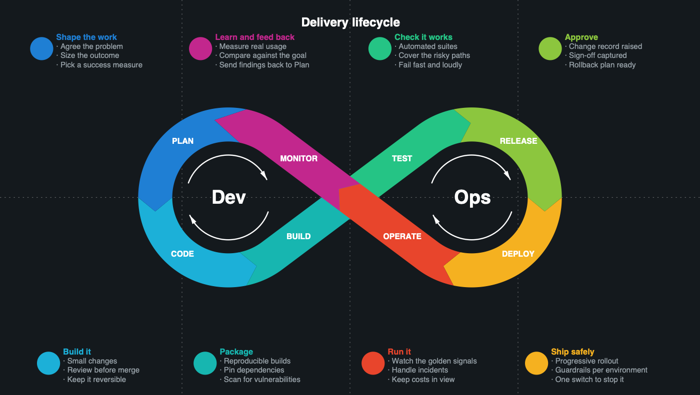
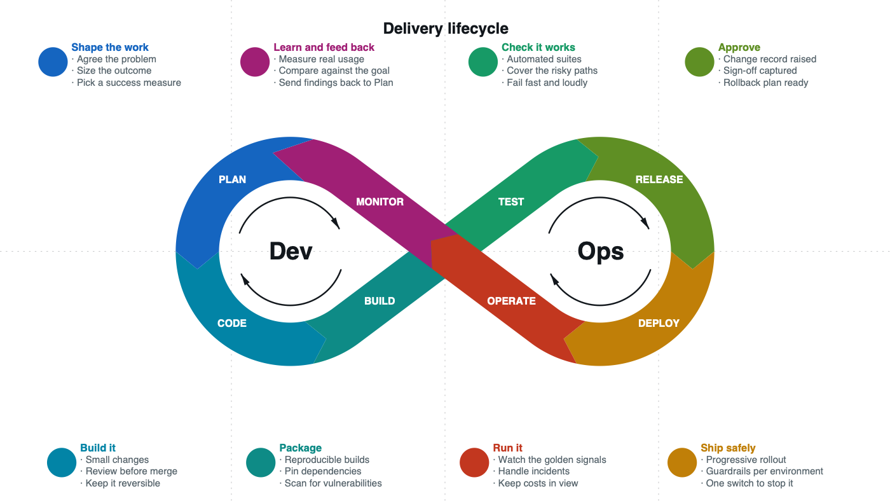

# loopgen

Makes a DevOps infinity loop from a YAML file. Writes plain SVG.



## The problem

I needed a custom infinity loop diagram. I wanted my own phase names without wasting time on AI images or design software. I wanted the diagram in git, alongside the document, in a format I could diff.

## The solution

Write the phases in YAML. Run the tool to get an SVG. Change a phase name, run it again, and commit the diff. No fuss.

## Install

You need Python 3.

```
pip install -r requirements.txt
```

PyYAML is the only requirement.

## Run it

```
python loopgen.py examples/delivery-loop.yml -o loop.svg
```

Open `loop.svg` in a browser.

## The config file

A config has three parts: a title, two lobe labels, and the stages. Only the stages are required. Provide two or more.

```yaml
title: Delivery lifecycle
lobes:
  left: Dev
  right: Ops
stages:
  - name: Plan
    label: Shape the work
    colour: "#1f7fd4"
    note: "Agree the problem\nSize the outcome"
  - name: Code
```

Each stage becomes a coloured band on the loop.

- `name` appears on the band.
- `label` is the callout heading. If omitted, the tool uses the name.
- `note` is the callout text. Each line becomes a bullet.
- `colour` overrides the default palette for that stage.

A bare string works if you only need a name.

## A guided example

Start with the phases. Nothing else.

```yaml
stages:
  - Plan
  - Code
  - Build
  - Test
  - Release
  - Deploy
  - Operate
  - Monitor
```

Run it. You get a loop with eight coloured bands and callouts. The callouts repeat the phase names, because there is nothing else to show yet.

Now define what each phase means.

```yaml
stages:
  - name: Plan
    label: Define problem and register
    note: "Validate the business problem\nInventory existing assets\nRegister the asset"
  - name: Code
    label: Design and provenance
    note: "Deterministic-first logic\nDocument LLM usage"
```

Run it again. The callouts now include the detail.

The lobes are wide and flat. That is the default curve. Change it.

```yaml
style:
  curve: rings
  ring_ratio: 0.85
```

The lobes are now circles connected by two straight lines. This is the common shape in DevOps graphics. Lower `ring_ratio` to stretch the crossover.

The callouts are crowded. Move them out.

```yaml
style:
  curve: rings
  ring_ratio: 0.85
  badge_layout: quadrant
```

Each callout now gets its own cell, above or below the loop, matching the position of its segment.

Finally, show the feedback edge. Monitor feeds back into Plan. Give that stage a deeper chevron.

```yaml
stages:
  - name: Monitor
    label: Measure and feed back
    arrow_depth: 96
```

That is the finished diagram. The full config is in `examples/delivery-loop.yml`.

## Themes

`theme` sets every colour that has to agree with the background. Use `dark` or `light`.

```yaml
style:
  theme: light
```



The two example configs differ by that one line. A theme only supplies defaults, so any colour you set yourself still wins.

Use a theme unless you have a reason not to. It removes two traps. The holes in the lobes show the background, so the `Dev` and `Ops` labels have to flip with it. And the band labels are white, so a light background needs deeper stage colours than a dark one.

## Style options

Put these under `style:`. All are optional.

### Shape

| Option | What it does |
|---|---|
| `width`, `height` | Size of the SVG in pixels |
| `scale` | Size of the loop inside the SVG |
| `curve` | `rings`, `bernoulli`, or `gerono` |
| `ring_ratio` | Lobe size when `curve` is `rings` |
| `aspect` | Makes the curve taller. `1.4` gives round lobes |
| `ribbon_width` | Thickness of the coloured band |
| `reverse` | Changes the direction of travel |
| `offset` | Moves all stages along the curve |

### Segments

| Option | What it does |
|---|---|
| `segment_style` | `butt` for flat joints, `arrow` for chevrons |
| `arrow_depth` | Depth of the chevron |

A stage can set its own `arrow` and `arrow_depth` to highlight one edge more than the others.

### Callouts

| Option | What it does |
|---|---|
| `badge_layout` | `auto`, `outside`, or `quadrant` |
| `badge_radius` | Size of the coloured circle |
| `badge_label_size` | Size of the callout heading |
| `note_size` | Size of the bullet text |
| `note_wrap` | Maximum characters in a line |
| `note_bullet` | Character before each bullet |
| `row_margin` | Space at the top and the bottom |

### Colours

| Option | What it does |
|---|---|
| `theme` | `dark` or `light`. Sets the defaults below |
| `background` | Background colour |
| `palette` | Default stage colours |
| `band_label_colour` | Colour of the label on the band |
| `note_colour` | Colour of the bullet text |
| `title_size`, `title_colour` | Title size and colour |
| `grid`, `grid_colour`, `grid_opacity`, `grid_dash` | The broken lines |

## The three curves

`rings` makes each lobe a circle. Two straight lines connect it to the crossing point. This gives the round shape of a typical DevOps graphic. Use `ring_ratio` to adjust it. A high value makes the lobes bigger and the waist shorter.

`bernoulli` is the classic lemniscate. Its lobes are wide and thin, about 0.71 as high as they are wide. Use `aspect: 1.4` to make them round.

`gerono` has lobes as high as they are wide. The curve is straight near the crossing point, so a thick band makes the hole too thin. Use `rings` instead.

## The callout layouts

`auto` places each callout in the nearest free space. This works for a few stages. The inside of a lobe holds two or three. More than that and they touch.

`outside` arranges all callouts in a row above and below the loop. Use this for many stages or long notes.

`quadrant` gives each callout its own cell, matching the position of its segment. Set `grid: true` to see the cells.

## Three things that will catch you out

**Eight-digit hex.** SVG 1.1 does not recognise that format. Some programs then draw nothing. Use six-digit hex and `grid_opacity` for transparency.

**Light backgrounds.** The holes in the lobes show the background. Set `loop_icon_colour` to a dark colour or the `Dev` and `Ops` labels disappear. Darken the phase colours too. The band labels are white. Setting `theme: light` does all of this for you.

**Long notes.** Four callouts share a row, so the longest line sets the text size for all of them. A larger SVG does not help. Use `note_wrap` to split the line.

## How the placement works

Two problems occur if you place the stages the simple way.

**Stages bunch up.** A lemniscate is not a circle. Equal steps along the curve do not give equal distances. Stages crowd near the crossing point. The tool measures the true distance along the curve and places stages at equal distances.

**Lobes get uneven counts.** If you start at the widest point, eight stages split 2-4-2 across the two lobes. The tool starts at the crossing point. One lobe fills before the next begins.

## Tests

Rendering is deterministic, so the SVG beside each example config is frozen ground truth.

```
python -m unittest discover tests
```

The tests render each example and compare the result byte for byte. They also check the placement rules above directly, because those are easy to break and hard to see by eye.

If you change the output on purpose, re-render the examples and commit the new SVGs.

```
for f in examples/*.yml; do python loopgen.py "$f" -o "${f%.yml}.svg"; done
```

## Output

Plain SVG. No JavaScript. No external files.

Keep it in git next to the document it illustrates.

## Licence

MIT. See [LICENSE](LICENSE).
